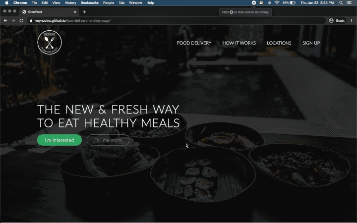

# food-delivery-landing-page

Mock food delivery service landing page.

[Live Demo](https://voynovinc.github.io/food-delivery-landing-page/ "View live here")

## Goal

The goal of this project was to get up to speed with web development basics:

- HTML5
- CSS3
- JQuery

## Challenges

It was interesting to learn and tinker with several things:

- JQuery in static websites
- Optimizing for the web
- Creating a mobile version of the landing page

## Conclusion

Thank you for your attention 👋
